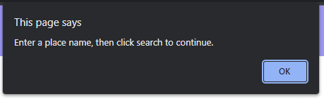

# Weather-Forecast-Dashboard

## Description

This weather forecast project has been an opportunity for me to bring together a lot of fundamental "Javascript" features that are new to me - APIs, local storage, Moment.JS, and has also allowed me to get better with working in HTML, CSS, JS, Bootstrap and JQuery. I wanted to create a weather page that would pull weather data for a location from a weather api, based on a users input, then push that information dynamically into the HTML. The aim was also to make the page remember previous search history and push that to the page on load.

I did find this project troubling, I have had some issues with content duplicating after repeated intertactions with the "Historical searches" buttons, this is something I would like to fix in the future, possibly when I'm not creating this for a set deadline, but it has been a fun learning curve and helped further my knowledge. Despite the issues the app has been a really fun build, and I also enjoyed working with the API and adding a bit of themed CSS to the page.

## Installation

You can access the deployed application via this link: [Weather Forecast Dashboard](https://emh93.github.io/Weather-Forecast-Dashboard/)

## Usage

The fully utilised application looks like the following:

On this page you can see the page in use, The main body of content shows the users most recent search parameter that they have either entered into the search box or selected from the "previous searches" list on the left-hand side. The main body displays today's weather in the location, the date, an icon for the weather, the current temperature, wind speed and humidity. Below this main display, we can see the next 5 days forecast with similar stats.

On page load, if the user has used the app before, the page will pull their most recent searches from local storage and list them as buttons below the search bar:

If the user tries to enter an empty value in the search bar they will also be prompted to input something into the field by the browser:

## Credits

- Starter code provided by edX front end developer bootcamp.
- Weather API used: [OpenWeatherMap](https://openweathermap.org/api)
- Consulted StackOverflow to ensure weather api url was correct: [StackOverflow](https://stackoverflow.com/questions/63222396/5-day-weather-forecast-on-openweathermap-not-giving-expected-result)
- Consulted StackOverflow to figure out icon url for img source: [StackOverflow](https://stackoverflow.com/questions/44177417/how-to-display-openweathermap-weather-icon)
- Background image used for application: [Pexels](https://www.pexels.com/photo/white-clouds-on-blue-sky-19670/)
- Consulted StackOverflow to figure out how to remove duplicates from localstorage array: [StackOverflow](https://stackoverflow.com/questions/9229645/remove-duplicate-values-from-js-array)

## License

MIT license